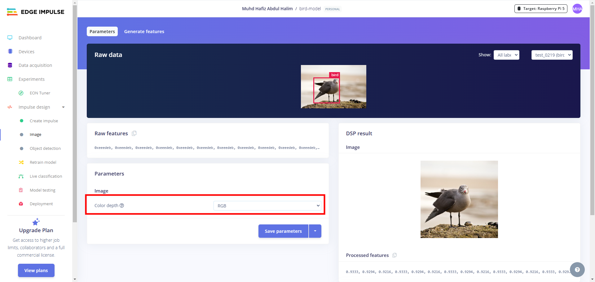

# Bird Laser Targeter on the Edge

## What is this project?

This repository stores the code for a program that uses a laser pointer and a couple of servos to scare off birds that are being menaces and flying into our homes. Hopefully what's being done here doesn't break any laws.

## Components

- [2 SG90 Servos and Pan Tilt Kit](https://sg.cytron.io/p-pan-tilt-servo-kit-for-camera-unassembled) x1
- [Laser Diode Module](https://shopee.sg/kuriosity.sg/8657033875) x1
- [Arduino UNO R3](https://shopee.sg/kuriosity.sg/27759981980) x1
- [Raspberry Pi 5](https://sg.cytron.io/p-raspberry-pi-5)
- [ESP32-CAM with MB Programmer](https://shopee.sg/kuriosity.sg/8557052439)
- Wires + Breadboard + Breadboard Power Module
- Any USB webcam (for testing)

## Installation on Raspberry Pi 5

You need to install git to clone this repository.

```bash
sudo apt update
sudo apt upgrade
sudo apt install git
```

Then you can clone this repo.

```bash
git clone https://github.com/dragonstonehafiz/sit-y2tri2-inf2009-edge-project.git
```

Next, we will set up the virtual environment used for this program.

```bash
cd dragonstonehafiz/sit-y2tri2-inf2009-edge-project.git
python -m venv venv
source venv/bin/activate
pip install -r requirements.txt
```

## Testing a controller detection model and a clap detection model trained on Edge Impulse

Before we can test the models, we need to change permissions on the downloaded eim file.

```bash
chmod +x model/detect-controller-v9.eim
chmod +x model/bird-detect-model-v1.eim
chmod +x model/detect-clap-v1.eim
```

### Controller detection model

Connect your USB webcam and run the code below. What this does is run the python script `TEST_EimBoundingBoxes.py` in the code_python folder. The script looks at each frame recorded by the webcam and runs inference using the `detect-controller-v9.eim` model. However, it ignores classifications that are for 'mouse', and only considers bounding boxes with confidence scores larger than 0.95. It then tracks the bounding box with the largest confidence score and renders it as an overlay.

```bash
python code_python/TEST_EimBoundingBoxes.py
```

**NOTE**: The model used in this script is `model/detect-controller-v9.eim` which is trained to detect video game controllers and computer mice.

**NOTE**: The code written in the script above was adapted from code in [this repo](https://github.com/edgeimpulse/linux-sdk-python). There are additional examples in this repo that you can make reference to when writing your own code using the inference library.

Expected output:


### Clap detection model

Connect your USB webcam (or a microphone) and run the code below. The code listens in on microphone zero and prints the message "Clapped!" if you clap near it.

```bash
python code_python/TEST_ClapDetect.py
```

**NOTE**: This code will use whatever microphone has the device id 0.

Expected output:


## Edge Impulse Model Settings

[Edge Impulse](https://edgeimpulse.com/) is a website that lets you **train object detection and audio classification models for edge devices** with minimal data. We will be using this site to train all our models. You can follow this [video guide](https://www.youtube.com/watch?v=dY3OSiJyne0). The remainder of this section will go through the settings we set for our model before training.

 In `Create Impulse` tab, set **Image width and Image height to 320**. We have to do this as the model we will be using only works with this input size.

 

 In the `Image` tab, make sure **Color Depth is RGB**.  Like before, inputs for the model we are using must be RGB.

 

 In the `Object Detection` tab, **change the model to MobileNetV2 SSD FPN-Lite 320x320**.

 

 In the `Deployment` tab, set **deployment environment to Linux (AARCH64)**.

 