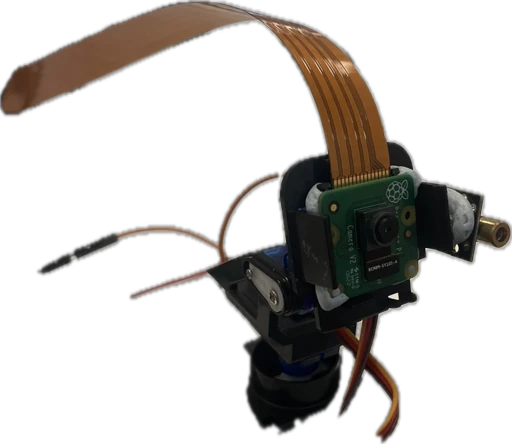

# Bird Laser Targeter on the Edge



## **Overview**

This repository contains the code for a bird deterrence system that utilizes a laser pointer and servo motors to **scare off birds** that may fly into homes and cause disturbances. The system runs on a **Raspberry Pi Zero 2W** and features wake activation, camera-based bird detection, and laser targeting.

## **Components**

The following components are required to build this project:

- [2 SG90 Servos and Pan Tilt Kit](https://sg.cytron.io/p-pan-tilt-servo-kit-for-camera-unassembled) x1
- [Laser Diode Module](https://shopee.sg/kuriosity.sg/8657033875) x1
- [Raspberry Pi Zero 2 WH](https://sg.cytron.io/p-raspberry-pi-zero-2-w) x1
- [Raspberry Pi Camera Module 2](https://sg.cytron.io/p-raspberry-pi-8mp-camera-module-v2) x1
- Any USB microphone (or a webcam with a microphone) x1

## System Design

This system is built to run on a Raspberry Pi Zero 2W using a lightweight Linux distribution. 
It integrates multiple hardware components—camera, servos, laser module, and microphone—to detect and deter birds through targeted motion and light. 
The PiCamera provides real-time video, which is processed locally or remotely using a YOLOv5 model to detect birds. 
Upon detection, servo motors orient the laser toward the target. Audio input can also trigger the system to begin scanning.

A USB microphone enables audio-based activation, while MQTT facilitates communication between the Pi and an optional remote server for processing or control. 
The system operates as a finite state machine with four main modes: IDLE, SCAN, TRACKING, and QUIT.

## Block Diagram and Control Flow


The software runs as a state machine on the Raspberry Pi, cycling between different operational states:

- **IDLE**: Waits for an audio trigger (e.g. bird chirp).
- **SCAN**: Sweeps the environment using servos while searching for a target.
- **TRACKING**: Tracks a detected bird and orients the laser accordingly.
- **QUIT**: Safely shuts down the system and disconnects all hardware.

The control flow supports two operating modes:
1. **Local Mode**: All detection and control run on the Pi using ONNX-based YOLOv5 inference.
2. **Remote Mode**: The Pi sends camera frames to a remote server over MQTT, which processes the frames and sends back control signals.


## Installation Instructions (Raspberry Pi Zero 2W)

### Requirements

- Raspberry Pi Zero 2W (running Raspberry Pi OS Lite 64-bit)
- CSI camera module (with `picamera2` support)
- 2x SG90 servo motors + Pan-Tilt kit
- Laser module (digital pin controlled)
- MQTT broker (e.g. Mosquitto, can be on local server)
- Python 3.9+

### Step 1: Update and Install System Packages

```bash
sudo apt update && sudo apt upgrade -y

# Core Python and system packages
sudo apt install -y python3 python3-pip python3-venv git
sudo apt install -y libopenblas-dev libjpeg-dev libtiff-dev
sudo apt install -y python3-opencv v4l-utils
sudo apt install -y portaudio19-dev

# Camera support
sudo apt install -y python3-picamera2

# MQTT client
sudo apt install -y mosquitto mosquitto-clients
```

### Step 2: Clone the Repository

```bash
git clone https://github.com/dragonstonehafiz/inf2009-project.git
cd inf2009-project
```

### Step 3: Set Up Virtual Environment

```bash
python3 -m venv venv
source venv/bin/activate
```

### Step 4: Install Python Dependencies

```bash
pip install -r requirements.txt --verbose

# Ensure compatible versions of MQTT and ONNXRuntime
pip install "paho-mqtt<2.0"
pip install onnxruntime==1.16.0 --no-cache-dir

# Reinstall numpy cleanly
pip uninstall numpy
pip install --no-cache-dir numpy

# Reinstall this package after new numpy install
sudo apt-get -y install libopenblas-dev
```

## Installation Instructions (Desktop Server)

This setup is optional and allows you to view the PiCamera feed remotely, run bird detection on a more powerful machine, and send servo commands back to the Raspberry Pi over MQTT.

### Requirements

- Linux Desktop (Ubuntu recommended)
- Python 3.9+
- Mosquitto

### Step 1: Install System Packages

```bash
sudo apt update && sudo apt upgrade -y
sudo apt install -y python3 python3-pip python3-venv git
sudo apt install -y mosquitto mosquitto-clients
sudo apt install -y libopencv-dev python3-opencv
```

### Step 2: Clone the Repository

```bash
git clone https://github.com/dragonstonehafiz/inf2009-project.git
cd inf2009-project
```

### Step 3: Set Up Virtual Environment

```bash
python3 -m venv venv
source venv/bin/activate
```

### Step 4: Install Python Dependencies

```bash
pip install -r requirements_server.txt
pip install "paho-mqtt<2.0"
pip install onnxruntime==1.16.0 --no-cache-dir
```

## Usage (Server)

Once installed, the server can be used to receive live camera feeds, process detections using YOLOv5, and send control commands back to the Raspberry Pi.

### Step 1: Activate the Mosquitto Server

```bash
sudo mosquitto -c /etc/mosquitto/mosquitto.conf
sudo systemctl start mosquitto
sudo systemctl enable mosquitto
sudo systemctl restart mosquitto
```

### Step 2: Start the Server Application

```bash
source venv/bin/activate
python server.py
```

### Step 3: Enter Control Commands

After launching, the server will prompt for control input. Here are some valid commands:

| Command         | Description                                    | Notes                   |
|-----------------|------------------------------------------------| ----------------------- |
| `state:scan`    | Start scanning (sweeping) for birds            | Only works with main.py |
| `state:idle`    | Return to idle mode                            | Only works with main.py |
| `state:tracking`| Force tracking mode                            | Only works with main.py |
| `state:quit`    | Shutdown the system                            | Only works with main.py |
| `turnx:<angle>` | Manually rotate X-axis servo (e.g., `turnx:10`)|                         |
| `turny:<angle>` | Manually rotate Y-axis servo                   |                         |
| `setx:<angle>`  | Set the X-axis servo angle (e.g., `setx:10`)   |                         |
| `sety:<angle>`  | Set the Y-axis servo angle (e.g., `sety:10`)   |                         |
| `laser:1`       | Turn on the laser                              |                         |
| `laser:0`       | Turn off the laser                             |                         |
| `auto:1`        | Enable automatic detection and targeting       |                         |
| `auto:0`        | Disable automatic targeting                    |                         |
| `quit:both`     | Shut down both server and Pi                   |                         |
| `quit:server`   | Exit the server only                           |                         |
| `quit:cam`      | Remotely stop the Pi application               |                         |


### Notes

- The server will display a window showing the camera feed in real time.
- You can get the ip address of the server with `ip address` in the terminal.

## Usage (Raspberry Pi Zero 2W)

This section explains how to operate the Pi-side components of the system, including calibration and the main detection loop.

### 1. Calibrate the Servos (Optional but Recommended)

Before running the main program, use `calibrate.py` to manually test and adjust servo/laser positions via the server.

```bash
source venv/bin/activate
python calibrate.py
```

This script:
- Sends camera feed from the Pi to the server.
- Accepts real-time control commands from the server (e.g., `turnx:10`, `turny:-5`, `laser:1`).
- Helps verify hardware alignment and response.

You will be prompted to enter the MQTT server IP.

### 2. Run the Main Detection Program

The main application is in `main.py`. It supports both **local detection** and **remote (server-side) detection**.

#### Example: Local Detection Only

```bash
python3 main.py --server false --cam-size 256 --send-image false
```

#### Example: Use Server for Detection

```bash
python3 main.py --server true --cam-size 256 --send-image true
```

You will be prompted for the MQTT broker IP if using server communication.


### States and Behavior

| State      | Description                                                            |
|------------|------------------------------------------------------------------------|
| `IDLE`     | System is listening for bird sounds.                                   |
| `SCAN`     | Sweeps camera using servos to search for birds.                        |
| `TRACKING` | Tracks detected birds and directs the laser.                           |
| `QUIT`     | Stops the program and safely disconnects hardware.                     |

State transitions happen automatically or can be triggered remotely from the server.


### Notes

- You can stop the program at any time with `Ctrl+C`.
- You can quit the program remotely from the server using the command `quit:cam`.
- The Pi will safely shut down all components and MQTT connections when exiting.