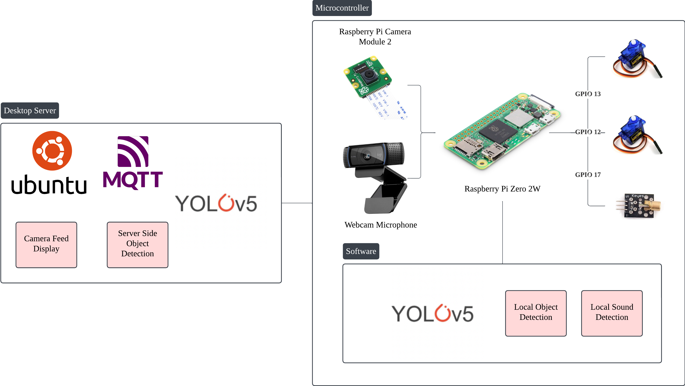

# **Bird Laser Targeter on the Edge**

## **Overview**

This repository contains the code for a bird deterrence system that utilizes a **laser pointer** and **servo motors** to **scare off birds** that may fly into homes and cause disturbances. The system runs on a **Raspberry Pi Zero 2W** and features **wake activation**, **camera-based bird detection**, and **laser targeting**.

## **Components**

The following components are required to build this project:

- [2 SG90 Servos and Pan Tilt Kit](https://sg.cytron.io/p-pan-tilt-servo-kit-for-camera-unassembled) x1
- [Laser Diode Module](https://shopee.sg/kuriosity.sg/8657033875) x1
- [Raspberry Pi Zero 2 WH](https://sg.cytron.io/p-raspberry-pi-zero-2-w)
- [ReSpeaker 2-Microphone Raspberry Pi HAT](https://sg.cytron.io/p-respeaker-2-microphone-raspberry-pi-hat)
- [CSI Camera](https://sg.cytron.io/p-5mp-camera-board-for-raspberry-pi)

## **System Design**

The software is designed to run on a **Raspberry Pi Zero 2W** with **Raspberry Pi Lite OS (32-bit)**. The Raspberry Pi Camera detects birds, while the **ReSpeaker HAT** enables wake activation. The camera is mounted on a **Pan Tilt Servo Kit**, which allows **180-degree rotation** on both axes for targeting. The **laser module** is attached to the servos for precise targeting.

### **Block Diagram & Software Flow**

Below is the **block diagram** of the system along with the **software workflow**:




## **Installation Instructions**

### **On Raspberry Pi Zero**

#### **Step 1: Install Required Packages**

Run the following commands to update your system and install the necessary dependencies:

```bash
sudo apt update
sudo apt upgrade -y
sudo apt install -y git portaudio19-dev python3 python3-pip python3-venv
sudo apt install -y python3-rpi.gpio python3-picamera2 mosquitto
```

#### **Step 2: Install Drivers for ReSpeaker Mic Hat**

```bash
git clone https://github.com/HinTak/seeed-voicecard.git
cd seeed-voicecard
git checkout v6.6
sudo ./install.sh
```

Reboot your Raspberry Pi Zero.

```bash
sudo reboot now
```

Test the microphone.

```bash
arecord -D plughw:CARD=seeed2micvoicec,DEV=0 -r 16000 -c 1 -f S16_LE -t wav -d 5 test.wav
aplay -D plughw:CARD=seeed2micvoicec,DEV=0 test.wav
```

#### **Step 3: Clone the Repository**

```bash
git clone https://github.com/dragonstonehafiz/inf2009-project.git
mv inf2009-project edge-project
cd edge-project
```

#### **Step 4: Set Up Virtual Environment**

```bash
python3 -m venv --system-site-packages venv
source venv/bin/activate
pip install -r requirements.txt
pip install "paho-mqtt<2.0"
```

### **(Optional) Running the Server on a Desktop**

If you want to **view the camera feed remotely**, you can set up a server on a desktop.

#### **Step 1: Install Required Packages**

```bash
sudo apt update
sudo apt upgrade -y
sudo apt install -y git python3 python3-pip mosquitto
```

#### **Step 2: Clone the Repository**

```bash
git clone https://github.com/dragonstonehafiz/inf2009-project.git
mv inf2009-project edge-project
cd edge-project
```

#### **Step 3: Set Up Virtual Environment**

```bash
python3 -m venv --system-site-packages venv
source venv/bin/activate
pip install -r requirements_server.txt
pip install "paho-mqtt<2.0"
```

## Usage

### Raspberry Pi Zero 2W 

*TODO*

### Server

Activate mosquitto server.

```bash
sudo mosquitto -c /etc/mosquitto/mosquitto.conf
sudo systemctl start mosquitto
sudo systemctl enable mosquitto
sudo systemctl restart mosquitto
```