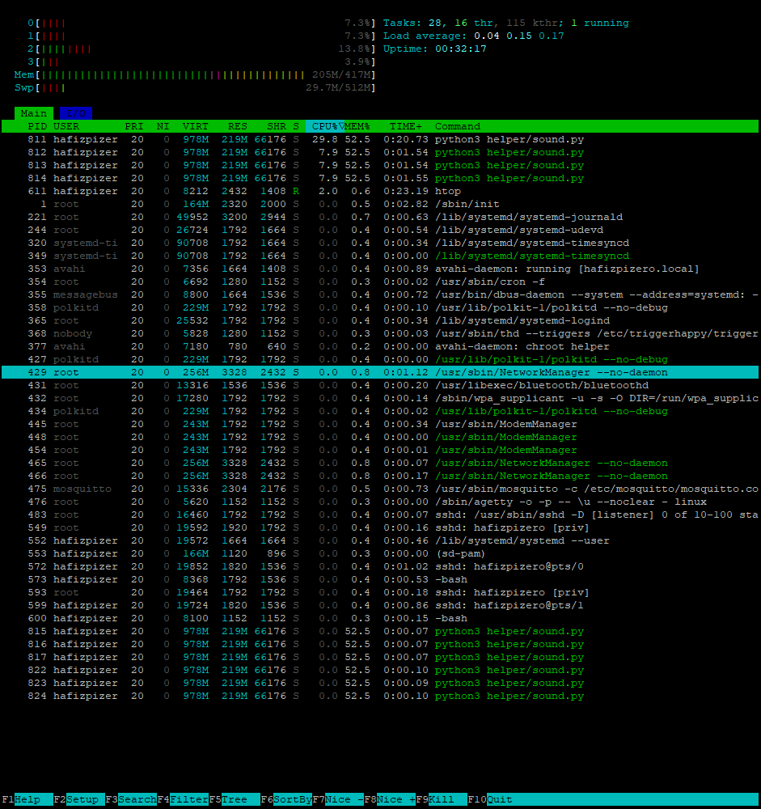

# Sound detection model log

## Model Training

A log for testing done when training a model to detect bird sounds.

- Initital model
    - Trained on raw audio of bird sounds combined with kopitiam ambience.
    - We were able to load the model on the Pi Zero 2, but it seemed to hang whenever it was used (`sound/test.py`).
    - When looking at core usage, we found that it was maxing out one of the cores, so we lowered the sample rate from *20500* to *16000* to try and reduce compute load.

- Second model
    - Same as previous model but only with smaller sampling rate. 
    - The model could run on the Pi Zero 2W without any noticable delays. However, it frequently misclassified ambience as being bird sounds.
    - We looked at the softmax output of the model and noticed that the outputs were way off from what we expected.

- Final model
    - On a hunch, we decided to retrain the model using audio recorded from the webcam (previously, we were just using raw audio we found online).
    - This model had much higher accuracy, and so we decided to use it.

## CPU Core Usage

Final Model

